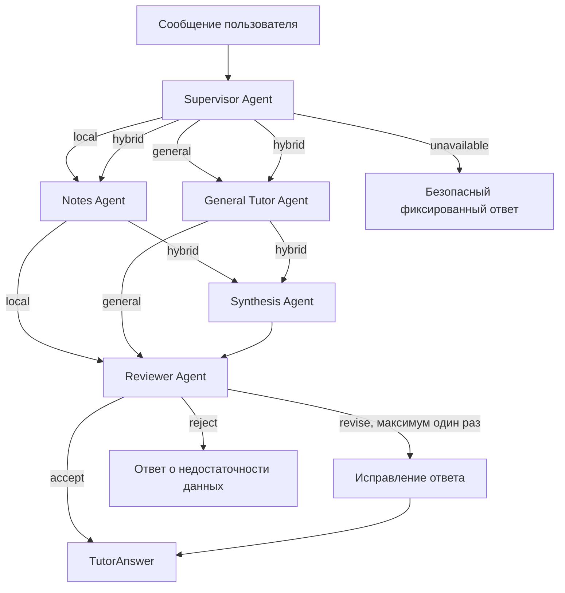

# План мультиагентной вкладки Chat на LangChain

## 1. Цель

Превратить текущую вкладку Chat в управляемый мультиагентный сценарий, который:

- отвечает по локальным заметкам через существующий hybrid RAG;
- отвечает на общеобразовательные вопросы средствами выбранной LLM;
- объединяет локальные и общие знания для смешанных вопросов;
- проверяет итоговый ответ на соответствие найденному контексту;
- сохраняет текущий выбор Ollama или Yandex AI Studio;
- предоставляет наблюдаемый граф выполнения для демонстрации в дипломной работе.

LangChain используется для моделей, prompts, tools и structured output. LangGraph используется как явный runtime оркестрации. Существующие retrieval, metadata, provider и observability-компоненты остаются проектным source of truth.

## 2. Почему выбран граф с маршрутизатором

Текущий `ChatService` уже классифицирует запрос как `local`, `general` или `unavailable`. Это хорошая точка миграции: существующий маршрутизатор заменяется supervisor-узлом, а текущие ветки становятся специализированными агентами.

Полностью автономный supervisor с неограниченным циклом здесь не нужен. Для учебного приложения важнее предсказуемость, ограничение числа LLM-вызовов и возможность объяснить каждый переход графа.

Целевые маршруты:

- `local` — вопрос требует только локальных заметок;
- `general` — достаточно общих знаний модели;
- `hybrid` — нужны локальные заметки и общие знания;
- `unavailable` — запрос выходит за разрешённые возможности приложения.

## 3. Состав агентов

### Supervisor Agent

Получает вопрос и краткую историю диалога. Возвращает Pydantic-решение: маршрут, уточнённые подзадачи для агентов и необходимость проверки ответа.

Supervisor не отвечает пользователю и не получает прямой доступ к файловой системе.

### Notes Agent

Использует существующий `TutorAnswerService` как read-only tool. Выполняет hybrid retrieval, context gate и grounded generation. Возвращает ответ, выбранные фрагменты, идентификаторы заметок и признак достаточности контекста.

### General Tutor Agent

Отвечает на учебный вопрос из общих знаний выбранной LLM. В результате явно указывает, что локальные заметки не использовались.

### Reviewer Agent

Получает черновик, маршрут и локальные источники. Возвращает структурированный вердикт:

- `accept`;
- `revise` с перечнем конкретных проблем;
- `reject` при отсутствии достаточных оснований для ответа.

Проверяет наличие неподтверждённых утверждений, соответствие вопросу и конфликт между локальной и общей ветками. Разрешается не более одной итерации исправления.

### Synthesis Agent

Запускается только для `hybrid`. Объединяет ответы Notes Agent и General Tutor Agent, отделяя сведения из заметок от дополнений модели. Не получает новых tools и не выполняет дополнительный поиск.

## 4. Граф выполнения

Notes Agent и General Tutor Agent выполняются параллельно только на маршруте `hybrid`.

## 5. Состояние графа

`ChatState` должен содержать только данные, необходимые узлам:

- `session_id` и `message_id`;
- исходный вопрос;
- ограниченную историю последних сообщений;
- решение supervisor;
- результаты локального и общего агентов;
- выбранные источники;
- итоговый ответ;
- вердикт reviewer;
- счётчик итераций;
- ошибки и диагностические данные.

Историю не следует передавать Notes Agent целиком. Он получает текущий вопрос и, при необходимости, сформированный supervisor самостоятельный поисковый запрос. Это уменьшает шум в retrieval.

## 6. Интеграция с текущей архитектурой

Новый слой располагается между Streamlit UI и существующими application services.

Предлагаемые компоненты:

- `application/chat_orchestrator.py` — интерфейс оркестратора;
- `orchestration/chat_state.py` — типизированное состояние;
- `orchestration/chat_supervisor.py` — structured routing;
- `orchestration/chat_graph.py` — сборка LangGraph;
- `orchestration/tools/local_notes_tool.py` — адаптер `TutorAnswerService`;
- `orchestration/agents/general_tutor_agent.py`;
- `orchestration/agents/answer_reviewer_agent.py`;
- `orchestration/agents/answer_synthesis_agent.py`.

`questions_page.py` должен зависеть от одного `ChatOrchestrator`, а не знать о составе агентов. Результатом остаётся расширенный `TutorAnswer`, поэтому текущий UI источников можно сохранить.

Существующие `LlmProvider`, `ObservedLlmProvider`, учёт токенов и выбор провайдера не следует обходить. Для LangChain нужен адаптер к текущему провайдеру либо единый model factory, который сохраняет те же callbacks и нормализованный usage. Прямое создание `ChatOllama` или `ChatOpenAI` внутри каждого агента приведёт к дублированию настроек и потере текущей телеметрии.

## 7. Наблюдаемость

Каждый запуск графа получает общий `trace_id`, а узлы записываются как дочерние observations:

- `chat.supervisor`;
- `chat.notes_agent`;
- `chat.general_agent`;
- `chat.synthesis_agent`;
- `chat.reviewer`;
- `chat.final`.

В payload фиксируются маршрут, длительность, provider/model, token usage, число найденных фрагментов, решение reviewer и причина fallback. Полные тексты заметок и секреты в telemetry не записываются.

LangSmith для проекта не обязателен: существующий Langfuse-контур уже решает задачу трассировки. LangGraph должен отправлять события через текущий `ObservabilityEventService`.

## 8. Этапы реализации

### Этап 0. Зафиксировать baseline

- Дополнить тесты текущего `ChatService` маршрутами и ошибками structured output.
- Измерить среднюю задержку, число LLM-вызовов и расход токенов для набора контрольных вопросов.
- Подготовить минимум 12 сценариев: local, general, hybrid и unavailable.

Результат: исходные показатели, с которыми можно сравнить мультиагентную версию.

### Этап 1. Подключить LangChain без изменения поведения

- Добавить совместимые версии `langchain-core`, `langchain` и `langgraph`.
- Создать адаптер текущего `LlmProvider` к LangChain chat model/runnable.
- Перенести router prompt на `ChatPromptTemplate` и structured output с Pydantic.
- Оставить маршруты `local`, `general`, `unavailable`.

Результат: прежний Chat работает через LangChain, но функционально не меняется.

### Этап 2. Ввести типизированный LangGraph

- Создать `ChatState` и узлы supervisor, local, general, unavailable.
- Собрать граф с условными переходами.
- Обернуть `TutorAnswerService` в read-only tool.
- Сохранить внешний контракт UI.

Результат: существующая логика выполняется как наблюдаемый граф.

### Этап 3. Добавить настоящий мультиагентный маршрут

- Добавить маршрут `hybrid`.
- Разделять вопрос на локальную и общую подзадачи.
- Выполнять Notes Agent и General Tutor Agent параллельно.
- Добавить Synthesis Agent и маркировку происхождения сведений.

Результат: один запрос может осмысленно использовать двух специализированных агентов.

### Этап 4. Добавить контроль качества

- Добавить Reviewer Agent со structured verdict.
- Разрешить максимум одну итерацию исправления.
- Ввести fallback при недостаточном контексте или конфликте источников.
- Защитить граф лимитом шагов и timeout на каждый LLM-вызов.

Результат: граф ограничен, тестируем и не может уйти в бесконечный agent loop.

### Этап 5. Сделать Chat многоходовым

- Добавить `session_id` в Streamlit session state.
- Подключить checkpointer LangGraph, сначала in-memory, затем SQLite при необходимости сохранять диалоги между перезапусками.
- Ограничивать историю скользящим окном или кратким summary.
- Добавить кнопки очистки и начала нового диалога.

Результат: уточняющие вопросы понимают контекст без передачи бесконечной истории.

### Этап 6. UI и демонстрация диплома

- Показывать этапы `Анализ запроса`, `Поиск в заметках`, `Проверка ответа`.
- Оставить технические детали графа в разворачиваемом блоке.
- Показывать использованные локальные источники и происхождение общих дополнений.
- Добавить сравнение baseline и multi-agent режима в документацию.

Результат: пользователь видит понятный ответ, а на защите можно продемонстрировать оркестрацию и трассу.

## 9. Тестирование

### Unit-тесты

- supervisor возвращает допустимый маршрут;
- каждый узел изменяет только свои поля состояния;
- local tool вызывает существующий сервис ровно один раз;
- reviewer не создаёт больше одной revision;
- unavailable не вызывает специализированные агенты;
- ошибки одного агента переводят граф в контролируемый fallback.

### Graph-тесты

- local: supervisor → notes → reviewer → final;
- general: supervisor → general → reviewer → final;
- hybrid: supervisor → notes + general → synthesis → reviewer → final;
- reject: reviewer → fallback;
- timeout: failed observation и ответ без падения Streamlit.

### Контрактные тесты

Расширить `llm_contract_cases.json` схемами supervisor и reviewer. Проверять Pydantic-валидацию отдельно от реального провайдера.

### Интеграционные тесты

- Ollama и Yandex используют одинаковый граф;
- токены учитываются для каждого LLM-вызова;
- все observations одного запроса имеют общий trace;
- UI показывает источники после local и hybrid маршрутов.

## 10. Метрики для дипломной работы

Сравнивать baseline и multi-agent режим на одном наборе вопросов:

- точность выбора маршрута;
- доля ответов, подтверждённых локальным контекстом;
- доля отклонённых reviewer неподтверждённых ответов;
- Recall@k или MRR retrieval для local/hybrid запросов;
- средняя и p95 задержка;
- среднее число LLM-вызовов;
- среднее число токенов;
- доля fallback и технических ошибок;
- экспертная оценка полезности ответа по шкале 1–5.

Для обоснования LangChain в дипломе важно показать не только код с агентами, но и измеримый компромисс: качество и объяснимость растут ценой дополнительных вызовов и задержки.

## 11. Ограничения первой версии

- Агенты работают только на чтение и не создают или не изменяют заметки.
- Web search не добавляется.
- Supervisor не выбирает произвольные tools вне заданного списка.
- Максимум два рабочих агента на запрос и одна revision.
- Для простого local/general запроса не запускается Synthesis Agent.
- При отказе LangChain-графа приложение возвращает контролируемую ошибку, не переключаясь незаметно на другую модель.

## 12. Критерии готовности

Функция считается завершённой, когда:

- четыре маршрута покрыты тестами;
- local и general запросы не стали обязательно проходить через все агенты;
- hybrid запускает две независимые ветки и синтезирует их результаты;
- все LLM-вызовы используют выбранный в Settings провайдер;
- источники local/hybrid ответа отображаются в Chat;
- reviewer ограничен одной итерацией;
- trace позволяет восстановить полный путь запроса;
- контрольный набор показывает результат не хуже baseline по качеству и содержит документированную оценку задержки и токенов.

## 13. Рекомендуемый первый инкремент

Начать только с этапа 0 и этапа 1: зафиксировать baseline, добавить зависимости и адаптер текущего `LlmProvider`, затем перенести существующий router на LangChain structured output. Это даст проверяемое подключение LangChain без одновременной замены работающего Chat и RAG.
